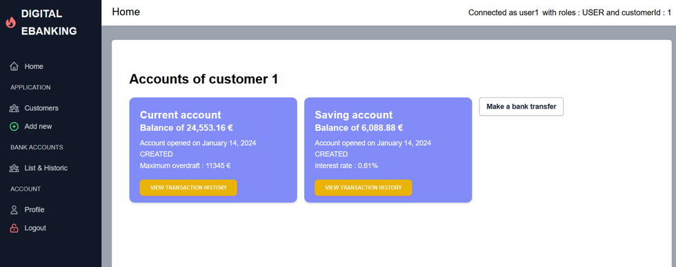
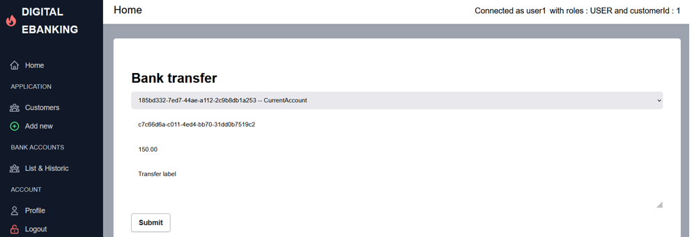
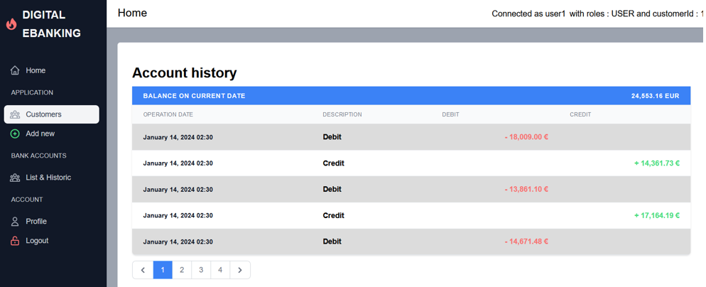

# EbankingWeb

Web application with authentication system allowing its users to consult their bank accounts, transaction histories and make transfers.

## Tech

#### Backend

-  REST API
-  Java 17 & Spring framework (Spring Data JPA, Spring Security)
-  PostgreSQL
-  Stateless authentication with JSON Web Token (JWT).

#### Frontend

-  Angular 16
-  Standalone Components
-  State management with NGRX (Redux pattern)

## Accounts of a customer

    

## Example of a bank transfer

    

## Account history

    

